# sharefin
A microservice to handle finances for closed groups of people

## Deployment

This application is intended as an extension to the [PLACEHOLDER] application. To host his extension, consider the following diagram:

```mermaid
graph LR
    user("👤 User")

    subgraph swarm["Docker Swarm"]
        subgraph frontend-container["frontend-container (Docker)"]
            frontend["Frontend App"]
        end
        subgraph backend-container["backend-container (Docker)"]
            fastapi["FastAPI App"]
        end
        subgraph db-container["db-container (Docker)"]
            mariadb[("MariaDB")]
        end
    end

    subgraph ext["External Microservice Platform"]
        subgraph user-service-container["user-service-container (Docker)"]
            userservice["User Microservice"]
        end
    end

    user -->|HTTPS| frontend
    frontend -->|"REST API (HTTP/JSON)"| fastapi
    fastapi -->|"SQL (TCP 3306)"| mariadb
    fastapi -->|"REST API (HTTP/JSON)"| userservice
```

